# 포스트잇 메모 웹 서비스
## 20185138 신영수


<!-- TOC -->
* [포스트잇 메모 웹 서비스](#포스트잇-메모-웹-서비스)
  * [Git 주소](#git-주소)
  * [시연영상](#시연영상)
    * [주의](#주의)
    * [주제 선정 사유](#주제-선정-사유)
    * [목표](#목표)
    * [주요 사용 기술](#주요-사용-기술)
      * [Nuxt를 사용한 이유](#nuxt를-사용한-이유)
  * [사용한 오픈소스](#사용한-오픈소스)
  * [웹 사이트의 주요 기능](#웹-사이트의-주요-기능)
  * [코드 요약](#코드-요약)
    * [Components](#components)
  * [Pages](#pages)
  * [개발 과정](#개발-과정)
    * [부트스트랩 학습, 프로토타임 웹 사이트 작성](#부트스트랩-학습-프로토타임-웹-사이트-작성)
    * [Nuxt 프로젝트 셋업](#nuxt-프로젝트-셋업)
    * [데이터베이스 셋업](#데이터베이스-셋업)
    * [백엔드 API 작성](#백엔드-api-작성)
    * [프로토 페이지를 vue로 재작성](#프로토-페이지를-vue로-재작성)
    * [배포](#배포)
  * [상세 기능 설명](#상세-기능-설명)
    * [메모](#메모)
    * [차트 (백 구현 X)](#차트--백-구현-x-)
    * [에디터](#에디터)
    * [로그인/회원가입](#로그인회원가입)
    * [알림/메세지 기능](#알림메세지-기능)
    * [반응형 디자인](#반응형-디자인)
    * [검색 기능](#검색-기능)
  * [아쉬운 점](#아쉬운-점)
  * [향후 추가할 점](#향후-추가할-점)
<!-- TOC -->

## Git 주소
https://github.com/vl0011/oss-final-project

## 시연영상
OBS 설정 문제로 영상을 나누어 짧게 녹화점 죄송합니다.  
설정 문제로 동영상이 줄어들어서 녹화되었습니다.

로그인 회원가입: https://youtu.be/stLsO-wh_qk  
메모 에디터: https://youtu.be/jQhpKeYnZZQ, https://youtu.be/a39VVg4C-m8

프론트 페이지 시연: https://youtu.be/yIsNdb0l3LM

### 주의
해당 웹 프로젝트는 호스트의 DB 커넥션 정보등의 환경변수 값이 요구됩니다.  
다른 호스트 실행 시, 오류가 발생 하거나, 정상된 동작을 하지 않습니다.

### 주제 선정 사유
캡스톤 활동을 하면서 벽면에 회의한 내용을 정리한 포스트잇을 덕지덕지 붙여본 경험이 있었습니다.  
포스트잇으로 메모를 쉽게 추가, 제거할 수 있으며, 메모의 순서를 변경하는등 다양한 메모의 표현이 가능했습니다.  
단순한 메모 도구처럼 1축으로 작성되는 메모가 아닌, 벽면에 붙이는 다양한 포스트잇 처럼 2축 방향의 메모가  
가능한 메모 도구가 있으면 좋겠다는 생각을 하였고, 이를 구현해 보기로 했습니다.

### 목표
1. 백엔드 개발 경험은 많으나, 프론트 개발이 적기 때문에, 최대한 다양한 부트스트랩 기능을 활용해 보자.
2. 기능적인 요소보다는, 프론트 완성도를 높이자.

효과적인 부트스트랩 학습을 위해, 다양한 예제를 체험해 볼 필요가 있음을 알게되었고,  
부트스트랩 공식 홈페이지, 부트스트렙 템플릿, 예제등을 참고하며 기본적인 부트스트렘을 학습 했습니다.

두단계의 프로젝트를 진행하여 프로젝트를 만들어 보았습니다.  
프로젝트 1. 부트스트랩 학습을 위해 강의 사이트와 템플릿등을 참조하며 기본 페이지 작성  
프로젝트 2. 메모 웹 사이트 작성, 프로젝트 1을 기반함.

- 프론트 UI/UX 구성
- 로그인
- 회원가입
- 메모 추가
- 메모 제거
- 다양한 메모 기능
  - 일반 메모
  - 이미지 메모
  - 이미지 썸네일 메모
  - ~~차트 메모~~
  - 에디터
  - ~~마크다운 에디터~~
  - ~~협업 기능~~

미완성 목표는 빗금 처리

### 주요 사용 기술
- Nuxt3  
  Ejs 대신 더 사용하기 편안하고 강력한 기능을 제공하는 VueJS 기반 풀스텍 프레임워크인 Nuxt3를 사용 했습니다.
- **Bootstrap5**
Bootstrap의 스타일과 다양한 컴포넌트를 사용 했습니다.
- **MongoDB**  
유저의 계정 정보와 메모 데이터를 저장합니다.
- Typescript  
- Scss

#### Nuxt를 사용한 이유
수업에 배운 스타일 프레임워크인 Bootstrap, 데이터베이스인 MongoDB은 그대로 사용 했으나,  
탬플릿 엔진으로 배운 Ejs, 백엔드 프레임 워크인 Express는 Nuxt로 대체하여 프로젝트를 구성 했습니다.  
다음 이유로 Ejs, Express 대신 Nuxt를 사용 했습니다.  
- Nuxt는 풀 스택 프레임워크로, 서버와 클라이언트 웹 페이지간 양방향 데이터 바인딩 구현이 쉽습니다.
- Ejs 대비 데이터를 HTML 문서에 삽입하는 방법이 편리합니다.
- Ejs대비 코드 재사용, 
- 각각 격리된 컴포넌트 구성으로 컴포넌트가 간섭이 없이 컴포넌트에 최적화된 스타일을 적용할 수 있습니다.
- HTML 문법을 그대로 사용할 수 있습니다.
- 타 풀스택 프레임워크 대비 가지는 장점
  - Angular는 오래되고 지원중단 프로젝트
  - SvelteKit은 공식문서와 예제가 미흡하여 제외
  - React 기반 NextJS 는 사용규모가 크고, 유저수도 많지만, React 특유의 문법으로 학습시간이 길다고 판단하여 제외

## 사용한 오픈소스
```json
# package.json 구성 (일부 생략)

{
  "devDependencies": {
    "nuxt": "3.0.0",
    "sass": "1.55.0",
    "sass-loader": "13.2.0"
  },
  "dependencies": {
    "@pinia/nuxt": "^0.4.6",
    "bootstrap": "^5.2.3",
    "bootstrap-icons": "^1.10.2",
    "mongoose": "^6.8.0",
    "mongoose-bcrypt": "^1.10.0"
  }
}
```

## 웹 사이트의 주요 기능
1. 유저 회원가입, 로그인 기능
2. 부트스트랩을 사용한 반응형 웹
    - PC, 태블릿, 모바일 대응 가능
    - 접속 환경에 따라 컴포넌트, 검색바를 숨기거나 확장
3. 부트스트랩을 사용한 스타일
   - 다크모드
4. 간편한 메모 추가 삭제
5. 메모에 이미지 첨부 가능
6. ...

## 코드 요약
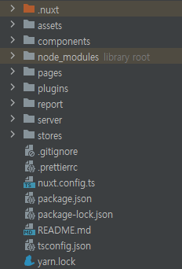  
프로젝트는 다음 폴더로 구성되어 있습니다.
- .nuxt: Nuxt3의 개발용, 빌드용 임시 파일
- assets: 사용자에게 제공될 사진, css, js 파일
- components: 웹사이트 구성요소 정의 폴더
- pages: 웹 페이지 정의 폴더
- plugins: 웹 앱 실행시 로드될 사용자정의, 3자제공 스크립트 정의 폴더
- report: 보고서
- server: 웹사이트 API Endpoints 정의 폴더
- store: @Pinia에서 사용할 클라이언트 데이터 스토리지 정의 폴더

### Components
Vue는 Page는 다양한 Components로 구성되며, Components를 사용하여 얻는 이점으로 다른 프로그래밍 언어의 Class처럼
반복되는 코드의 양을 줄이고, 계층화된 웹 구성이 가능하며, 컴포넌트 단위로 스타일, 스크립트를 적용하여 컴포넌트간
간섭을 없에 효율적인 웹 페이지 개발이 가능합니다.  
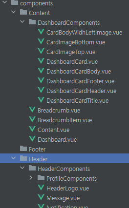
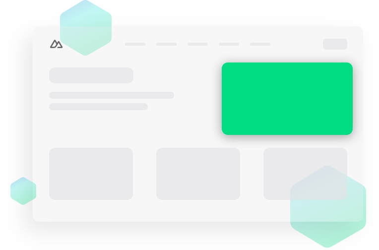

```html
# Header.vue

<template>
  <header id="header" class="header fixed-top d-flex align-items-center">
    <HeaderLogo />
    <i class="bi bi-list toggle-sidebar-btn" @click="store.change();"></i>
    <SearchBar />
    <nav class="header-nav ms-auto">
      <ul class="d-flex align-items-center">
        <Search />
        <Notification />
        <Message />
        <Profile />
      </ul>
    </nav><!-- End Icons Navigation -->

  </header><!-- End Header -->

</template>

<script setup lang="ts">

import HeaderLogo from "~/components/Header/HeaderComponents/HeaderLogo.vue";
import Notification from "~/components/Header/HeaderComponents/Notification.vue";
import Message from "~/components/Header/HeaderComponents/Message.vue";
import Profile from "~/components/Header/HeaderComponents/Profile.vue";
import SearchBar from "~/components/Header/HeaderComponents/SearchBar.vue";
import { useSideStatus } from "~/stores/frontStatus";
import Search from "~/components/Header/HeaderComponents/Search.vue";

const store = useSideStatus();

</script>

<style scoped>


.toggle-sidebar-btn {
  font-size: 32px;
  padding-left: 10px;
  cursor: pointer;
  color: #012970;
}

.header {
  transition: all 0.5s;
  z-index: 997;
  height: 60px;
  box-shadow: 0px 2px 20px rgba(1, 41, 112, 0.1);
  background-color: #fff;
  padding-left: 20px;
  /* Toggle Sidebar Button */
  /* Search Bar */
}
</style>

```

Header Componets 의 예시 입니다.  
Header는 다음 하위 컴포넌트를 가집니다.
- HeaderLogo: 헤더 로고
- SearchBar: 검색 
- ...  

컴포넌트를 정의하여 메뉴등의 반복된 구조의 코드를 줄이고, 기능별로 컴포넌트를 정의하여 효율적인 코드 작성이
가능 했습니다.

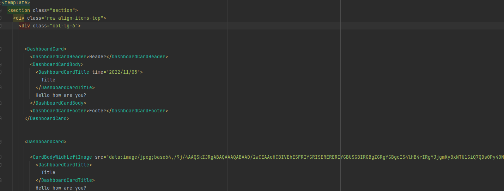
메모를 표현하는 컴포넌트 예시 입니다.

## Pages
웹 페이지를 정의하며, 디렉토리 구조에 따라 웹 라우팅을 합니다.  
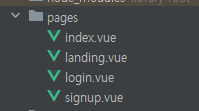  
메인 페이즈는 index.vue, 로그인, 회원가입 페이지로 login, signup.vue 를 작성 했습니다.  
만약 로그인 페이지로 접속하고자 하면, [웹사이트 URL]/login 으로 접속 시, 자동으로 login.vue로 정의한 
페이지로 라우팅 됩니다.
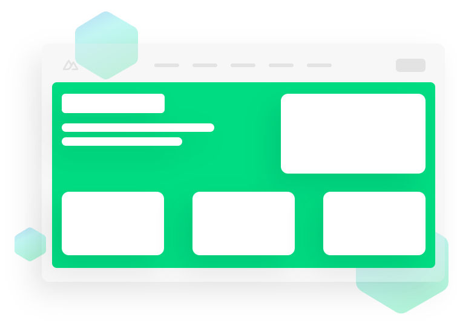
```vue
# index.vue 예시
<template>
  <Header/>
  <SideBar/>
  <Content/>
</template>

<script setup lang="ts">

</script>
```
Header, SideVar, Content 3개의 하위 컴포넌트를 가집니다.

## 개발 과정
### 부트스트랩 학습, 프로토타임 웹 사이트 작성
Nuxt를 사용하지 않은, 부트스트랩을 활용한 기능이 없는 프론트엔드 페이지를 만들어 보았습니다.  
부트스트랩을 공부하는 시간이 되었고, 최대한 외부 라이브러리 개입 없이 부트스트랩 만으로 프론트 페이지를  
구성해 보고 싶었습니다.  
부트스트랩 예제와 참조한 템플릿기반으로 임시 콘텐츠를 작성한 상태 입니다.

카드  
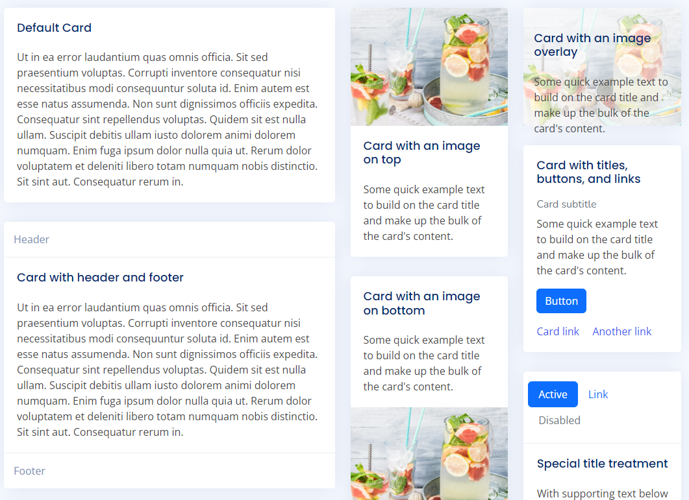

차트 표현 (Chart.js)    
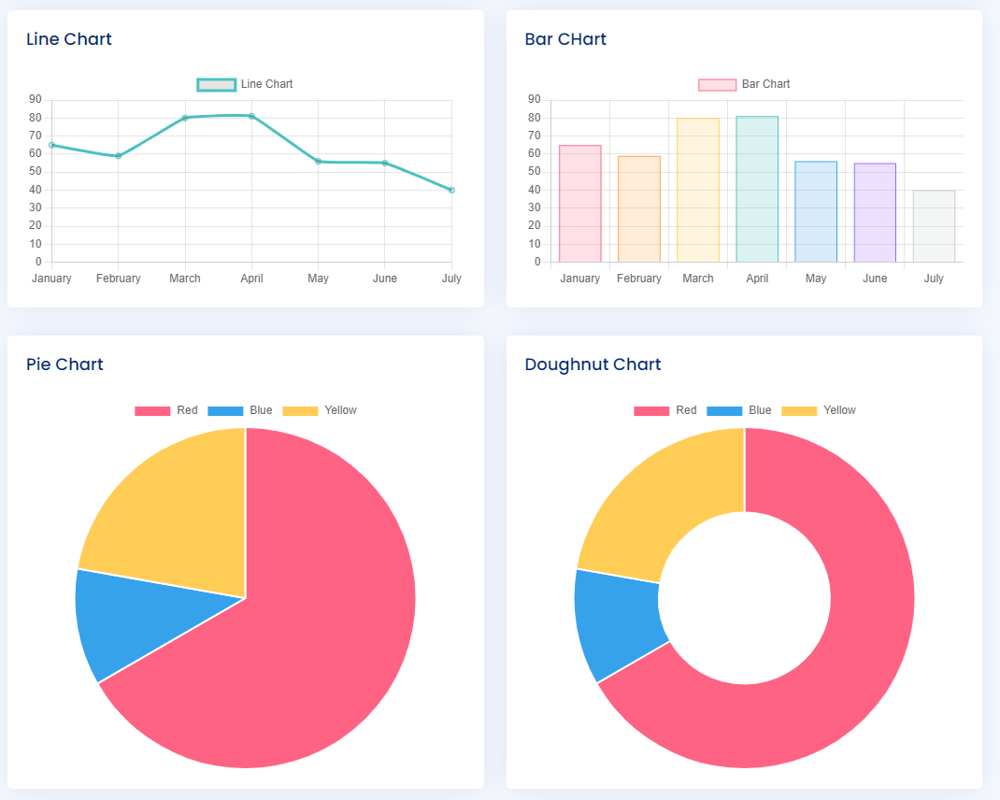

갤러리  
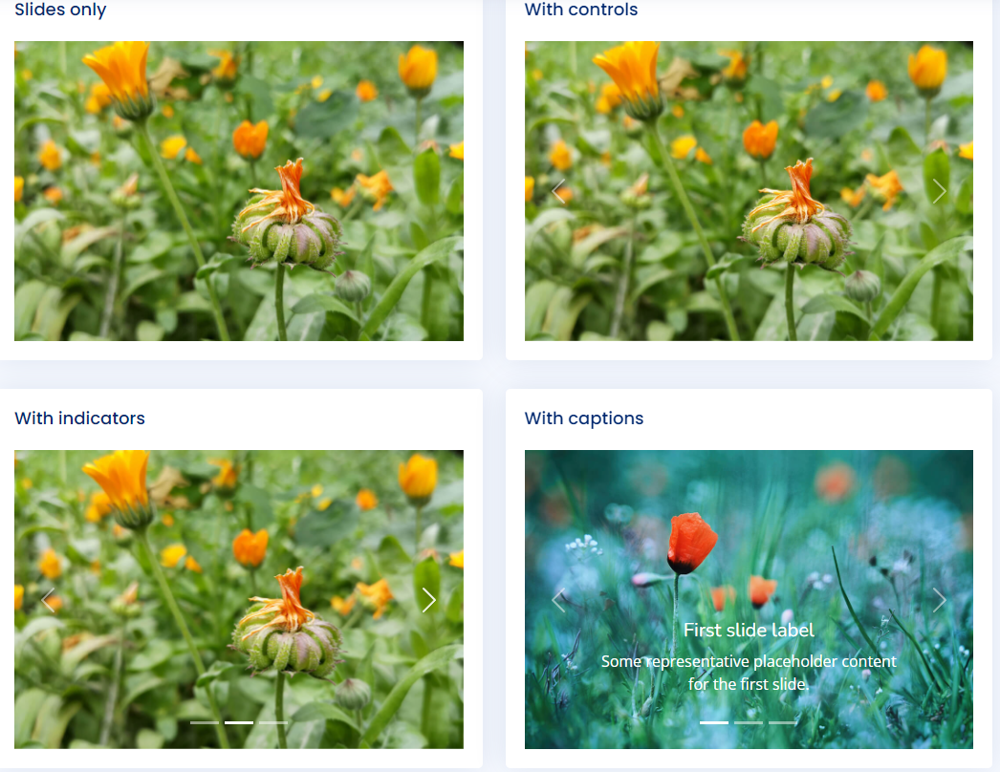

모달  
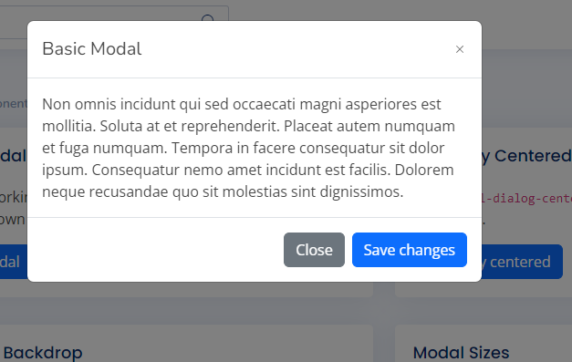

에디터  
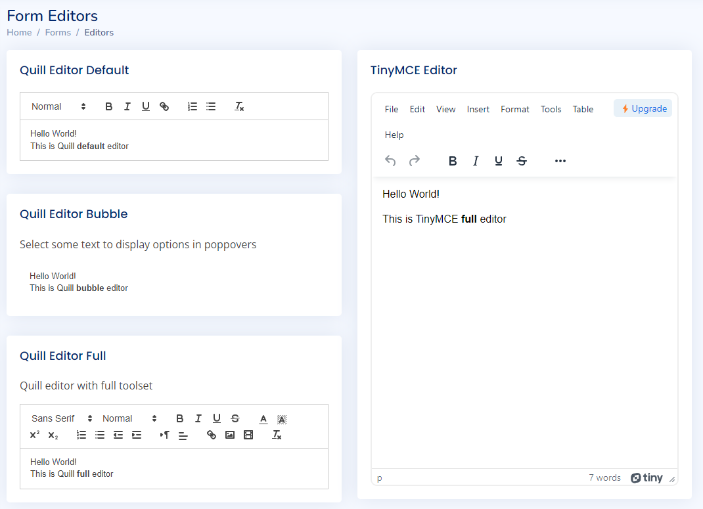

로그인 페이지  
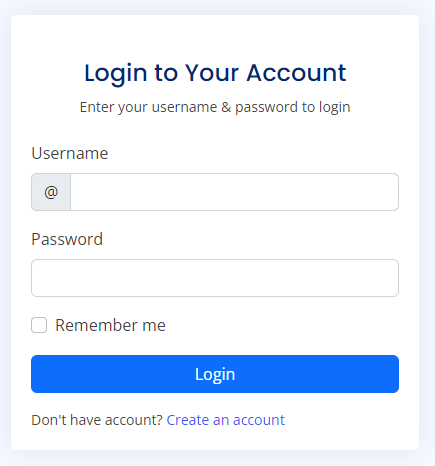

사이드 메뉴  
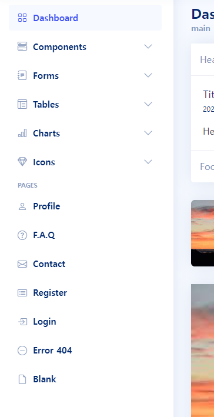

차트 표현 페이지 코드 일부  
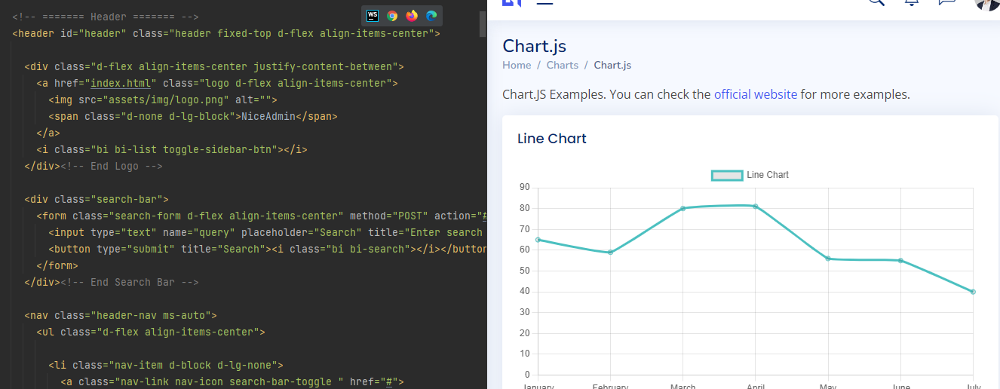

### Nuxt 프로젝트 셋업
Nuxt 프로젝트를 생성 했습니다.  
Nuxt 공식 가이드를 참조하여 npx, yarn 등의 도구를 사용하여 Nuxt 환경을 구성 했습니다.  
부트스트랩을 셋업할때 가장 시간이 걸렸습니다.  
Nuxt3 는 Nuxt2 와 다르게 공식 에드온을 제공하지 않기에 직접 설치, 적용하려 했습니다.  
Nuxt-Vue 프로젝트의 GitHub Issue를 참조하여 프로젝트 설정을 할 수 있었습니다.

로그인 상태, 사이드/검색 바를 키고 끄는 토글 정보를 저장할 스토어 라이브러리 Pinia등 여러 라이브러리를  
추가하며 프로젝트를 구성 했습니다.

### 데이터베이스 셋업
수업시간에 배운 MongoDB Atlas를 그대로 사용 했습니다.

### 백엔드 API 작성
회원가입, 로그인을 위한 API 를 작성 했습니다. JSON으로 메세지를 주고받으며,  
비밀번호등의 정보는 BCrypt 암호화를 사용 했습니다.

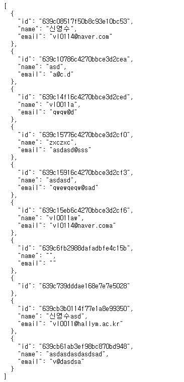  
테스트를 하면서 추가된 임시 유저 정보입니다.  
비밀번호의 노출을 방지하기 위해 비밀번호는 출력되지 않습니다.

  
### 프로토 페이지를 vue로 재작성
반복되는 코드를 컴포넌트 단위로 압축하며 코드의 양을 줄이고, 데이터 바인딩이 필요한 부분의 스크립트를
작성 했습니다.
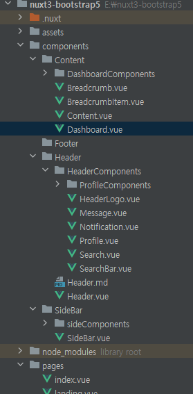

### 배포
Nuxt는 순수 JS, CSS, HTML 로 변환 하여 Node 기반 서버로 배포가 가능 합니다.      
Node기반의 서버로 컴파일 하여, Vultr 웹 서비스에 호스팅 하였습니다.  
GCP 대비 저렴한 가격으로 Vultr를 사용 했습니다.  

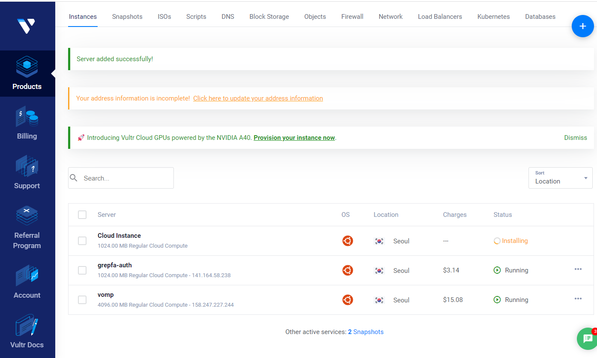  
서버 구현 과정 중 클라우드 인스턴스를 생성하는 과정  

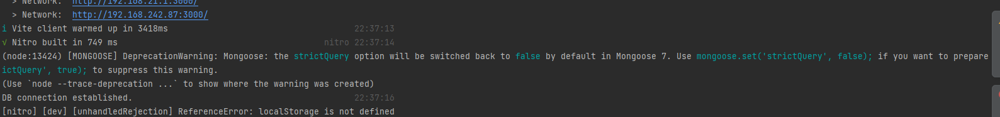  
서버 실행 로그 (WebStorm IDE 콘솔로 SSH 로 서버에 접속한 모습)

우분투 22.04, Nginx를 사용하여 웹 서버를 구성 했습니다.

## 상세 기능 설명

### 메모
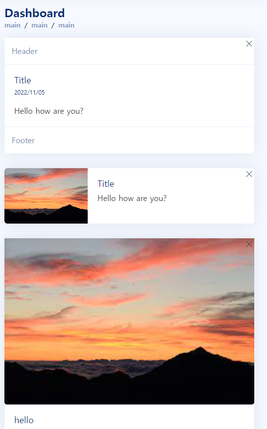
메모가 표현되는 모습입니다.
작성날자 표현 선택이 가능하며
Header 와 Footer를 보이거나 숨길 수 있습니다.
이미지를 메모 좌측에 표현하거나, 메모 상/하단에 크게 표현이 가능합니다.

### 차트 (백 구현 X)
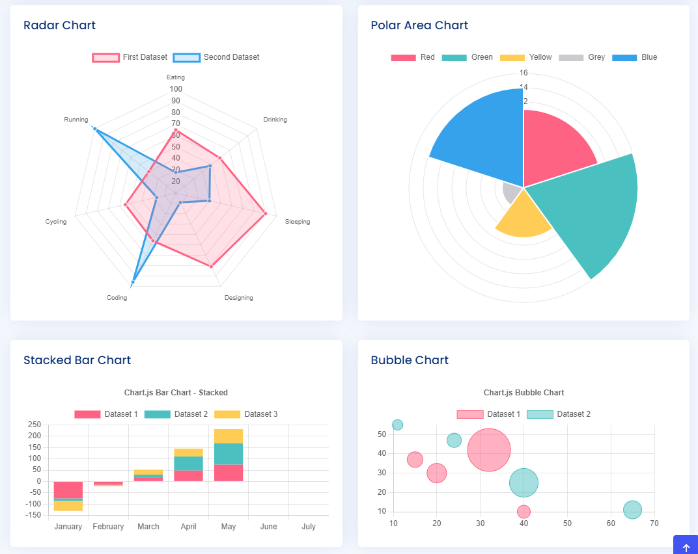
프론트 프로젝트에만 구현 했습니다.  
차트 데이터 입력에 관한 구현의 어려움으로 백엔드 기능을 구현하지 못했습니다.

### 에디터
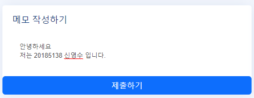  
quill-editor 를 사용 했습니다.  
최대한 단순하고 간결한 구성을 위해 에디터 도구를 꺼놨습니다.

### 로그인/회원가입
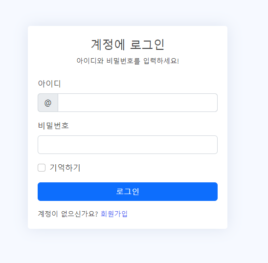  
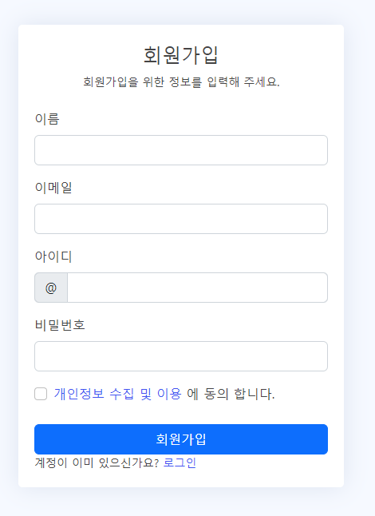  
로그인, 회원가입 페이지 입니다.
로그인 상태에 따라 프로필 표현이 달라집니다.
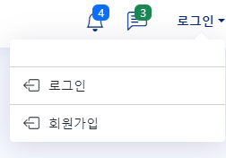  
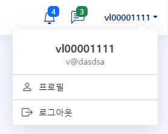  
로그인 완료시 계정 아이디와 가입시 메일이 표현 됩니다.

### 알림/메세지 기능
협업 기능의 일부로 프론트 프로젝트에만 표현된 기능 입니다.  
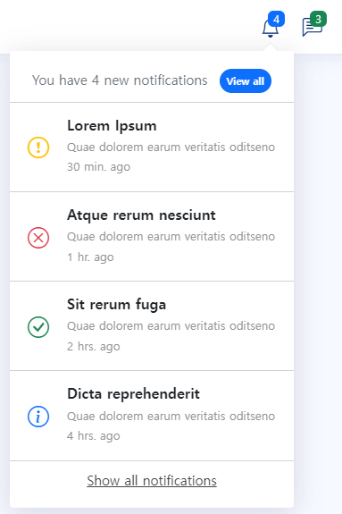  
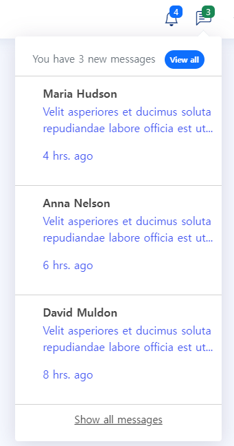  
협업 기능을 구현하지 못하여 학습때 넣은 임시 데이터가 출력 됩니다.

### 반응형 디자인

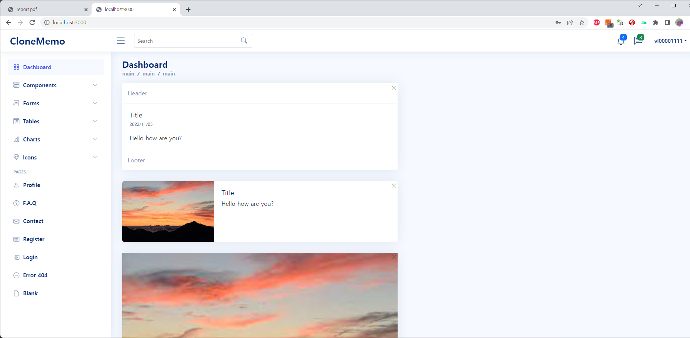  
xd
메뉴가 나타나며, 상단 버튼으로 메뉴를 숨길수 있습니다.

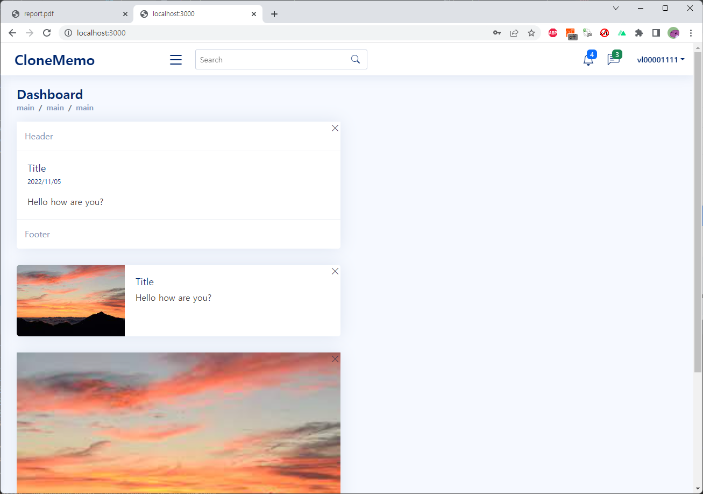  
md
메뉴가 사라지며, 상단 버튼으로 메뉴를 보일수 있습니다.

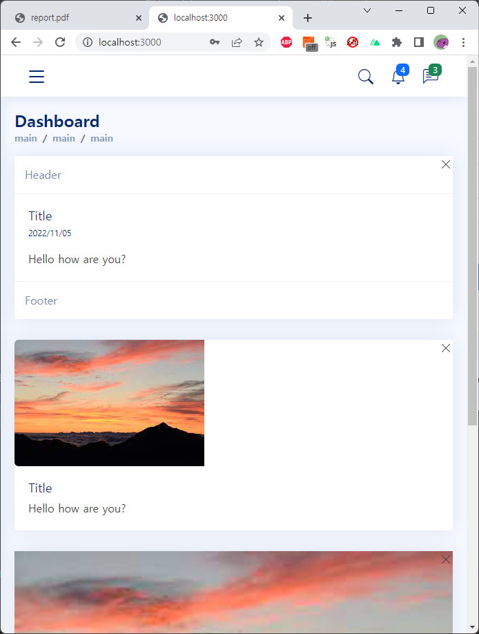  
sd
메뉴와, 검색바가 사라지며, 상단 버튼으로 이들을 보일수 있습니다.
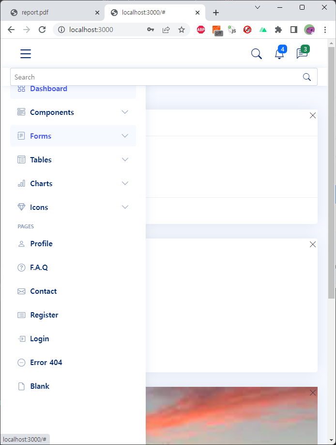

### 검색 기능
시간상 문제로 백엔드 기능을 추가하지 못했습니다.

## 아쉬운 점
프론트 페이지 구현을 우선시 하다보니, 목표한 기능을 전부 구현하지 못했습니다.
프로젝트 두개를 이어서 작업하였기 때문에, 저번 프로젝트에서 사용하지 않을 기능을 제거해야 했지만,
시간상 문제로 사용하지 않거나, 개발용으로 만들어둔 페이지가 그대로 노출되었습니다.

## 향후 추가할 점
배포하여 클라우드에 업로드 하였지만, 본 프로젝트는 미완성 프로젝트 입니다.  
목표로한 개발 목표를 완수하고, 다양한 기능을 추가하여, 실제 서비스하는 웹 서비스를  
만들고자 합니다.  

본 수업 이후, 더 추가하면 좋을 기능을 고민해 보았습니다.
- 웹 사이트 소개와 설명을 표현할 랜딩페이지
- 차트 등의 데이터 시각화 도구 (프론트 구현 완료)
- 외부 API 혹은 Mqtt 등의 브로커와 연동한 실시간 데이터 표현
- 다양한 유저와 협업, 공유 기능
- 마크다운 에디터 지원 (프론트 구현 완료)
- 메모를 파일, 혹은 이미지로 저장하는 기능
- 구글 광고 삽입
- Github issue, team, project 와 연동하여 팀 협업 개발 기능 추가


본 보고서는 마크다운을 기반으로 작성되었습니다.
